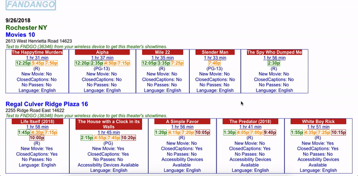

# Fandango-XML
Knowledge Representation Techniques @ RIT - HW (XML, DTD, XSD, XSLT, CSS)

## A preview

## How to try it out? 
Clone the repository and open '01/fandango.xml' or '02/fandango.xml' using a browser like Firefox. 
You can validate using https://xmlvalidation.com against the .dtd or .xsd
